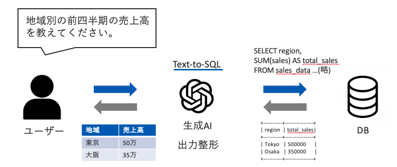

# Talq: 用语言与数据交流

**Talq** 是一款用自然语言操作数据库的工具，它使不了解编程的人也能直观地从数据库中提取信息。

例如，当销售人员想要了解客户的评价信息时，他不需要学习复杂的 SQL，只需要在聊天栏中输入：“给我看看电子产品的用户评价”， Talq就可以将用户的自然语言问题转化为SQL查询，去数据库中获取数据

我们希望Talq将帮助您从根本上改变使用数据库的体验，用语言与您的数据交流

## 演示数据集

下面的演示数据集是一个包含 1465 种商品的产品信息表，主要信息如下：
#### Products 表及字段名

|---------------- |-------------------|-------------------|--------------------|
| 产品ID          | ⭐ 评分            | 🏷️ 类别           | 📋 产品介绍         |
| 📝 产品名称     | 📊 评分计数        | 💰 折扣价格       | 👤 用户ID           |
| 💲 实际价格     | 🙋‍♂️ 用户名       | 💸 折扣百分比     | 📝 评价者ID         |
| 📰 评价标题     | 🗒️ 评价内容       | 🖼️ 图像链接       | 🔗 产品链接         |

### 📈 有了Talq 小助手，弹指之间即可完成复杂的销售查询和分析。快来试试吧！

### 🔍 不妨问问小T：

    1.有多少种不同的产品类别？
    2.哪种类别的平均折扣率最高。
    3.目前有哪些电子产品的折扣价格低于500元？
    4.评分在4.5以上的产品有哪些？找出其中最高的不超过5个。
    5.风扇产品的评分有多少个？平均评分是多少？
    6.我想看看这款产品（ID为B09RFB2SJQ）的用户评论。

